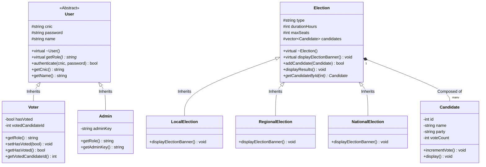

# 🗳️ AuraVote — C++ Object-Oriented Electronic Voting Architecture

<p align="center">
  
  
  
  
  
</p>

> **AuraVote** is an academic software engineering project demonstrating the practical application of the **4 Core Pillars of Object-Oriented Programming (OOP)** in pure **C++20**. It models a tamper-resistant electronic voting infrastructure with role-based authentication, polymorphic election hierarchies, single-vote invariant enforcement, digital audit receipts, and an interactive **Glassmorphic Web Visualizer** with **Real-Time Call Stack Tracing**.

---

## 📑 Table of Contents

- [Core OOP Pillars in Architecture](#-core-oop-pillars-in-architecture)
- [System Architecture & UML Class Matrix](#-system-architecture--uml-class-matrix)
- [Project Directory Structure](#-project-directory-structure)
- [Interactive Web Visualizer & Live Stack Tracer](#-interactive-web-visualizer--live-stack-tracer)
- [Compilation & Execution Guide](#-compilation--execution-guide)
  - [Option 1: Visual Studio 2022 (Recommended)](#option-1-visual-studio-2022-recommended)
  - [Option 2: GCC / G++ (Command Line)](#option-2-gcc--g-command-line)
  - [Option 3: Web GUI Simulation](#option-3-web-gui-simulation)
- [Data Persistence & Security Invariants](#-data-persistence--security-invariants)
- [Design System & Aesthetics](#-design-system--aesthetics)
- [Contributors & Academic Attribution](#-contributors--academic-attribution)
- [License](#-license)

---

## 🎓 Core OOP Pillars in Architecture

The primary pedagogical focus of this repository is demonstrating how the **4 Core Pillars of Object-Oriented Programming** govern a mission-critical electronic voting system:

```
                              ┌──────────────────────────────┐
                              │  4 Pillars of OOP Design     │
                              └──────────────┬───────────────┘
          ┌──────────────────────────┬───────┴──────────┬──────────────────────────┐
          ▼                          ▼                  ▼                          ▼
   1. Encapsulation           2. Inheritance     3. Polymorphism            4. Abstraction
  (Private Data Invariants)  (Class Hierarchies) (Dynamic Dispatch)        (Abstract Contracts)
```

### 1. 🔒 Encapsulation (Data Protection & Invariant Integrity)
- **Data Hiding**: Sensitive fields (`cnic`, `password`, `voteCount`, `hasVoted`, `votedCandidateId`) are declared `private` or `protected`.
- **Controlled Access**: State mutation occurs only through verified member functions:
  ```cpp
  class Candidate {
  private:
      int id;
      string name;
      string party;
      int voteCount; // Guarded from direct external mutation
  public:
      void incrementVote() { voteCount++; }
      int getVoteCount() const { return voteCount; }
  };
  ```
- **Invariant Protection**: The `Voter` class enforces the rule that a citizen can only vote once via `setHasVoted(true)`.

### 2. 🧬 Inheritance (Hierarchical Code Reusability)
- **User Specialization**: An abstract base class `User` provides common credential properties (`cnic`, `password`, `name`) inherited by `Voter` and `Admin`:
  ```cpp
  class User { /* Base attributes and methods */ };
  class Voter : public User { /* Adds hasVoted status & receipt tracking */ };
  class Admin : public User { /* Adds adminKey & system management methods */ };
  ```
- **Election Specialization**: Base class `Election` is inherited by tiered election entities:
  - `LocalElection`: Municipal elections (5 maximum seats, 24h cycle).
  - `RegionalElection`: Provincial elections (8 maximum seats, 36h cycle).
  - `NationalElection`: General federal elections (12 maximum seats, 48h cycle).

### 3. ⚡ Polymorphism (Dynamic Binding & Virtual Dispatch)
- **Pure Virtual Contracts**: Base class `User` declares:
  ```cpp
  virtual string getRole() const = 0;
  ```
  Allowing base pointers (`User* u = new Voter(...)`) to dynamically invoke derived implementations at runtime.
- **Dynamic Banner Rendering**: Base class `Election` overrides `displayElectionBanner()`, enabling runtime pointer dispatch:
  ```cpp
  Election* currentElection = new NationalElection();
  currentElection->displayElectionBanner(); // Dynamically outputs National Federal header
  ```

### 4. 🧩 Abstraction (Separation of Interface & Implementation)
- Low-level internal details (such as vector resizing, formatting algorithms, and credential verification) are concealed behind clean public interfaces.
- The `EVotingSystem` controller interacts with elections purely through high-level polymorphic abstractions.

---

## 📐 System Architecture & UML Class Matrix



> 📖 For full method signatures, sequence diagrams, and lifecycle specifications, see [`docs/UML_ARCHITECTURE.md`](docs/UML_ARCHITECTURE.md).

---

## 📁 Project Directory Structure

The repository is organized following clean software engineering principles, separating core source code, test modules, web frontend assets, and architecture documentation:

```
OOP-Project-E-Voting-System-/
├── .gitattributes                           # Git line-ending and diff configuration
├── .gitignore                               # Ignore rules for binaries, build objects & runtime logs
├── README.md                                # Comprehensive academic documentation
├── index.html                               # Interactive OOP Web Visualizer & Live Stack GUI
│
├── assets/                                  # Web Visualizer Frontend Assets
│   ├── css/
│   │   └── styles.css                       # Skin / Beige Glassmorphic & Parallax Design Engine
│   └── js/
│       └── app.js                           # Real-Time Voting, Call Stack Tracer & State Engine
│
├── src/                                     # Core C++ Object-Oriented Software Architecture
│   ├── Main Code.cpp                        # Pure C++20 Core Implementation (510+ LOC)
│   ├── OOP Project(E Voting System).vcxproj # Visual Studio Project File
│   └── OOP Project(E Voting System).vcxproj.filters
│
├── tests/                                   # Unit Test Modules & Experimental Prototypes
│   ├── Test 1.cpp                           # Early Candidate/Election Class Prototype
│   └── Test 2.cpp                           # User Authentication & File Stream Prototype
│
├── docs/                                    # Academic Specifications & Diagrams
│   └── UML_ARCHITECTURE.md                 # Detailed UML Class Diagram & Sequence Flows
│
└── OOP Project(E Voting System).sln         # Visual Studio 2022 Solution File
```

---

## 🌐 Interactive Web Visualizer & Live Stack Tracer

This repository includes a standalone **Glassmorphic Web Visualizer** (`index.html`) featuring an organic **warm skin / nude / champagne** aesthetic:

- 📊 **Interactive OOP Pillars**: Inspect code snippets and rationale for Encapsulation, Inheritance, Polymorphism, and Abstraction.
- ⚡ **Live Call Stack Tracer**: As you click candidates, witness simulated C++ method calls in real time (e.g. `User::authenticate()` -> `Voter::setHasVoted(true)` -> `Candidate::incrementVote()` -> `FileStream::append()`).
- 📈 **Real-Time Live Results**: Visualized with **Chart.js** bar graphs dynamically updated upon every ballot submission.
- 🛡️ **Cryptographic Audit Receipt**: Generates a tamper-evident digital receipt with SHA-256 simulation and voter verification stamps.

---

## 💻 Compilation & Execution Guide

### Option 1: Visual Studio 2022 (Recommended)
1. Double-click [`OOP Project(E Voting System).sln`](OOP%20Project(E%20Voting%20System).sln) to open the solution in Visual Studio 2022.
2. Select configuration: **Release** or **Debug** with target **x64**.
3. Press **Ctrl + Shift + B** to build the solution.
4. Press **Ctrl + F5** to run the interactive console application.

### Option 2: GCC / G++ (Command Line)
To compile using `g++` (C++17 or C++20 standard):

```bash
# Clone the repository
git clone https://github.com/minahilkhalidmk/evotingsystem.git
cd evotingsystem

# Compile the core C++ application
g++ -std=c++17 "src/Main Code.cpp" -o EVotingSystem.exe

# Execute the binary
./EVotingSystem.exe
```

### Option 3: Web GUI Simulation
Simply double-click `index.html` in your file explorer, or serve using Python's lightweight HTTP server:

```bash
python -m http.server 8000
```
Open `http://localhost:8000` in Google Chrome, Microsoft Edge, or Mozilla Firefox.

---

## 🛡️ Data Persistence & Security Invariants

The system maintains real-time auditability through file streams:

| File Target | Schema / Format | Description |
| :--- | :--- | :--- |
| `votes.txt` | `[CNIC],[CANDIDATE_ID],[CANDIDATE_NAME]` | Append-only transaction log recorded upon vote submission. |
| `voters.txt` | `[CNIC],[PASSWORD],[NAME],[HAS_VOTED]` | Persistent registry of registered voters and voting status. |

### Core Security Rules:
1. **Single Ballot Rule**: `voter->getHasVoted()` check prevents multiple ballot submissions per CNIC.
2. **Abstract Role Enforcement**: Generic `User` objects cannot be instantiated directly; all users must be concrete `Voter` or `Admin` instances.
3. **Session Demarcation**: Voter sessions cannot alter election settings or candidate rosters; administrative operations require validated `Admin` privileges.

---

## 🎨 Design System & Aesthetics

The web showcase employs a curated **Warm Nude / Skin Tone** palette engineered for visual comfort:

| Token Name | Hex Code | Semantic Role |
| :--- | :--- | :--- |
| `--bg-base` | `#FBF7F4` | Porcelain / Warm Alabaster Primary Canvas |
| `--bg-secondary` | `#F5EBE0` | Soft Cream Ambient Background Shift |
| `--skin-nude` | `#D5BDAF` | Frosted Nude Glass Card Backgrounds |
| `--skin-warm` | `#E3CAA5` | Warm Beige Accent Highlights |
| `--terracotta` | `#C68B59` | Primary Action Buttons & Live Indicators |
| `--champagne-gold`| `#D4AF37` | Gold Badges & Winning Candidate Highlights |
| `--mocha-dark` | `#2B1E1E` | Deep Mocha High-Contrast Typography |

---

## 👨‍💻 Contributors & Academic Attribution

- **Developer**: **Minahil Khalid** ([@minahilkhalidmk](https://github.com/minahilkhalidmk))
- **Course**: **CS-201 — Object-Oriented Programming**
- **Domain**: Electronic Voting Systems & Secure Software Design

---

## 📜 License

This project is licensed under the **MIT License** — feel free to use, adapt, and build upon it for educational and academic purposes.
