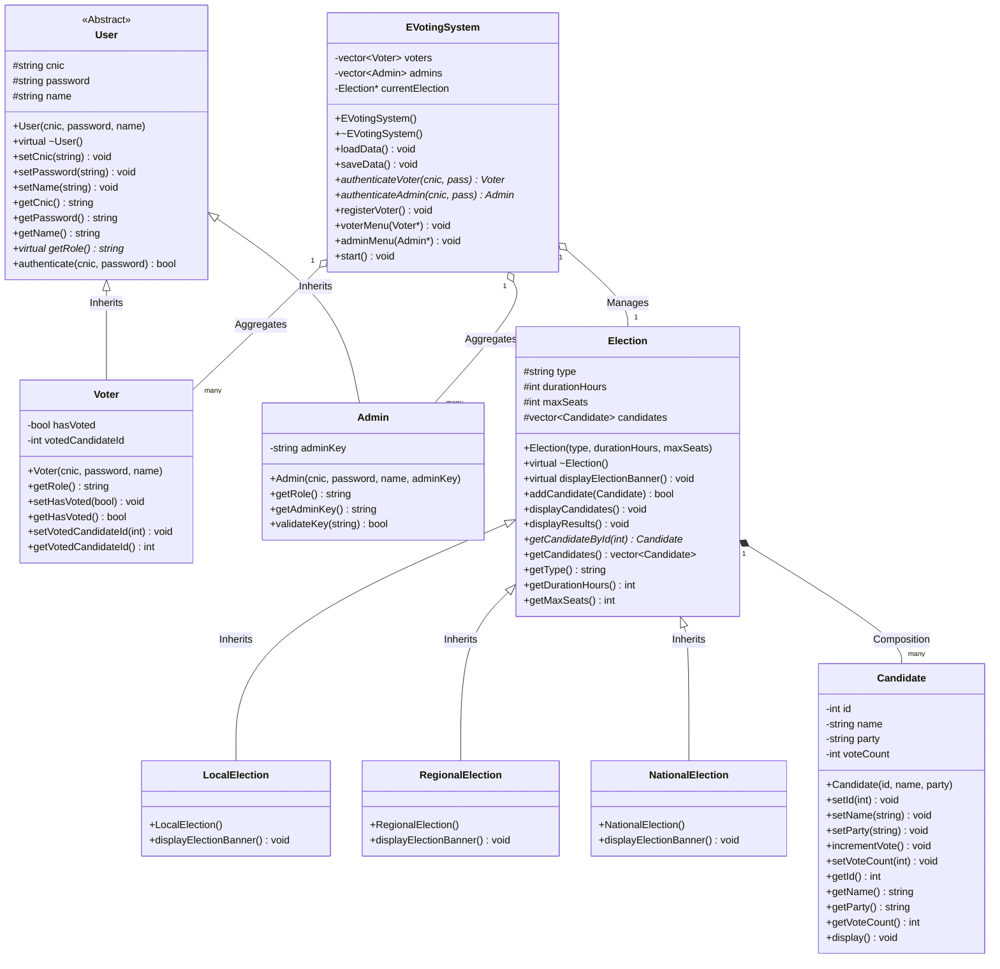
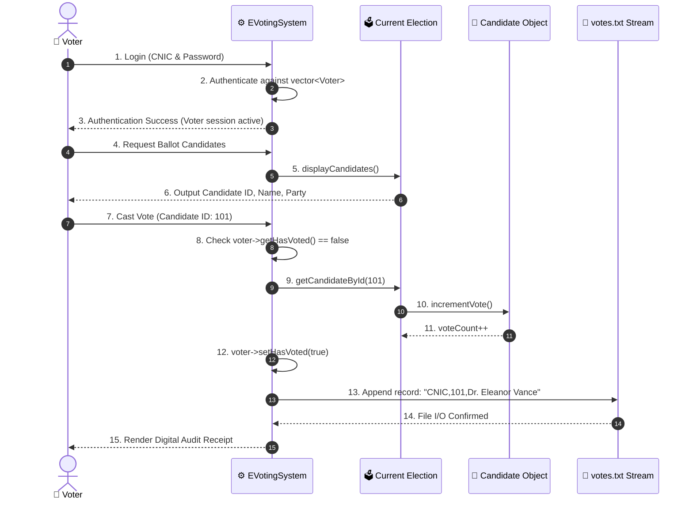

# 🏛️ Architecture & UML Class Matrix — AuraVote E-Voting System

This document provides a detailed technical specification of the **Object-Oriented Software Architecture** powering **AuraVote**, implemented in pure **C++20** and accompanied by an interactive **Glassmorphic Web Visualizer**.

---

## 🎯 1. The 4 Core Pillars of Object-Oriented Design

```
                     ┌──────────────────────────────┐
                     │ 4 Core Pillars of OOP Design │
                     └──────────────┬───────────────┘
          ┌─────────────────┬───────┴─────────┬─────────────────┐
          ▼                 ▼                 ▼                 ▼
   1. Encapsulation  2. Inheritance    3. Polymorphism    4. Abstraction
  (Data Protection) (Code Reusability) (Dynamic Dispatch) (Contract Design)
```

### 1.1 🔒 Encapsulation (Data Protection & Invariant Enforcement)
- **Data Hiding**: In `Candidate`, `User`, `Voter`, and `Election`, internal state variables (`cnic`, `password`, `voteCount`, `hasVoted`, `votedCandidateId`) are guarded under `private` or `protected` specifiers.
- **Accessors & Mutators**: State transitions occur strictly through validated methods:
  - `Candidate::incrementVote()` atomically increments the ballot count.
  - `Voter::setHasVoted(true)` permanently enforces the single-vote invariant.
  - `User::authenticate(cnic, pass)` provides read-only credential comparison without leaking raw passwords.

### 1.2 🧬 Inheritance (Hierarchical Code Reusability)
- **User Hierarchy**:
  ```
  User (Abstract Base)
   ├── Voter (Specialized voter attributes: hasVoted, votedCandidateId)
   └── Admin (Specialized administrative privileges: adminKey, candidate registry)
  ```
- **Election Hierarchy**:
  ```
  Election (Base Class: duration, seats, candidate vector)
   ├── LocalElection    (Local Municipal Election: 24h duration, 5 seats)
   ├── RegionalElection (Provincial/State Election: 36h duration, 8 seats)
   └── NationalElection (Federal General Election: 48h duration, 12 seats)
  ```

### 1.3 ⚡ Polymorphism (Runtime Dynamic Dispatch)
- **Pure Virtual Functions**: Base class `User` declares:
  ```cpp
  virtual string getRole() const = 0;
  ```
  Derived classes implement their specialized roles at runtime (`"Voter"`, `"Admin"`).
- **Virtual Method Overriding**: Base class `Election` declares `virtual void displayElectionBanner() const`, allowing polymorphic pointers (`Election* currentElection`) to dynamically invoke:
  - `LocalElection::displayElectionBanner()`
  - `RegionalElection::displayElectionBanner()`
  - `NationalElection::displayElectionBanner()`

### 1.4 🧩 Abstraction (Contract Specification & Complexity Hiding)
- High-level business logic interacts with `User*` and `Election*` pointers rather than low-level concrete implementations.
- Consumers of the `Election` class do not need to know whether candidates are stored in an array or a `std::vector<Candidate>` — they interact purely through public contracts like `addCandidate()` and `displayResults()`.

---

## 📐 2. Complete UML Class Diagram



---

## 🔄 3. Sequence Flow: Voting & Audit Receipt



---

## 💾 4. File I/O Persistence Stream Specifications

| File Name | Format / Schema | Trigger Event | Security Invariant |
| :--- | :--- | :--- | :--- |
| `votes.txt` | `[CNIC],[CANDIDATE_ID],[CANDIDATE_NAME]` | Appended on successful vote cast | Append-only; each CNIC appears at most once |
| `voters.txt` | `[CNIC],[PASSWORD_HASH],[FULL_NAME],[HAS_VOTED]` | Updated upon new voter registration or vote | Loaded into memory during system startup |

---

## 🛡️ 5. Security & Invariant Matrix

1. **One-Person One-Vote Invariant**:
   - Stored in memory via `Voter::hasVoted`.
   - Verified before displaying ballot options.
   - Any attempt to cast a second ballot emits an immediate `[WARNING] Duplicate vote rejected` alert.
2. **Abstract Role Security**:
   - `User::getRole()` is pure virtual, making direct instantiation of generic `User` objects impossible at compile time.
3. **Admin Privilege Boundary**:
   - Candidate management and election switching are restricted strictly to authenticated `Admin` sessions verifying the administrative secret key.
